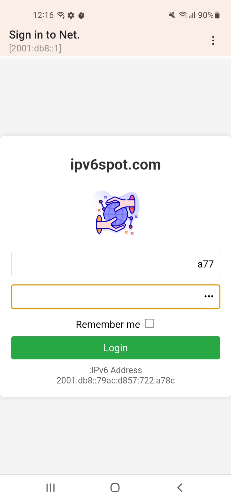

## 💽 IPv6Spot installation
- **💽 IPv6Spot installation guide with iso file download link to install the system:**
- Link 1 [installation guide](https://youtu.be/Iejz8vUP9wY?si=NBwTcxjhvVZ8RIn_)
- Link 2 [iso file download link](https://drive.google.com/file/d/1aDe7ILiZPsQL_ZeCsoAG2Kg7vWE2YxC3/view?pli=1)
- 📌 Currently, the IPv6Spot system operates on the x86_64 architecture, with plans for future development to support additional architectures.

Screenshots of IPv6Spot System Installation:

  
  

Screenshots of IPv6Spot System:

  
  
  
  
  
  
  
  
  
  
  
  
  
  
  
  

Screenshots of user login using the captive portal:

  
  
  
  
  
  
  

- Main File Directory: /mnt/cerr Copy all files and folders to the directory: /mnt/cerr.

- File tree directory:

		db  >> Database encryption and backup files
		web_dist >> Web Dashboard Pages Files
		console >> Create virtual interfaces for IPv6Spot
		main_sqlite3_database.db >> Main system database Sqlite3
		external_domains >> The addresses of the sites you want to block are stored using the IPv6Spot system.
		dns_server_main.py >> DNS server
		nftable_conf_ipv6 >> nftables rules file
		captive_portal_server.py >> IPv6Spot system
		web_server_main.py >> Back-End of the web control panel
		proxy_server_main.py >> IPv6Spot Web Proxy  A Captive portal detection URLs 
		proxy_server_slave.py >> IPv6Spot Web Proxy  B Respond to detection URLs 
		OpenWRT version used in the system:
		OpenWRT 22.03.0
		Kernel Version	5.10.138

- Operating requirements:

		python --version > Python 3.10.13
		scapy version  2.5.0

	 -

		NAT64 for a IPv6-only network (Jool) >> https://openwrt.org/docs/guide-user/network/ipv6/nat64
  		conntrack
		python3-lzma	3.10.13-2
		python3-multiprocessing	3.10.13-2
		python3-ncurses	3.10.13-2
		python3-openssl	3.10.13-2
		python3-pillow	9.5.0-2
		python3-pip	23.0.1-1
		python3-pkg-resources
		python3-ply	3.11-2
		python3-psutil	5.9.0-2
		python3-pycparser	2.21-2
		python3-pydoc	3.10.13-2
		python3-readline	3.10.13-2
		python3-setuptools	65.5.0-1
		python3-sqlite3	3.10.13-2
		python3-unittest	3.10.13-2
		python3-urllib	3.10.13-2
		python3-uuid	3.10.13-2
		python3-xml python3-xml	3.10.13-2
		python3	3.10.13-2
		python3-asyncio	3.10.13-2
		python3-base	3.10.13-2
		python3-bidict	0.21.2-2
		python3-cffi	1.16.0-1
		python3-cgi	3.10.13-2
		python3-cgitb	3.10.13-2
		python3-codecs	3.10.13-2
		python3-ctypes	3.10.13-2
		python3-dbm	3.10.13-2
		python3-decimal	3.10.13-2
		python3-dev	3.10.13-2
		python3-distutils	3.10.13-2
		python3-email	3.10.13-2
		python3-lib2to3	3.10.13-2
		python3-light	3.10.13-2
		python3-logging	3.10.13-2
		tc-full
		tc-mod-iptables
		sqlite3-cli	3410200-1
		libsqlite3-0	3410200-1
		ip6tables
		nftables
		xtables-nft
		kmod-ip6tables
		ip-full
		iputils-arping
		nmap
		kmod-veth

- pip list
  Package                     Version
------------------------- --------
  	aiodns                    3.2.0
  	aiohttp                   3.9.5
  	aiosignal                 1.3.1
  	altgraph                  0.17.4
  	annotated-types           0.7.0
  	anyio                     4.4.0
  	APScheduler               3.10.4
  	arabic-reshaper           3.0.0
  	async-timeout             4.0.3
  	asyncio                   3.4.3
  	attrs                     23.2.0
  	bcrypt                    4.2.0
  	bidict                    0.21.2
  	blinker                   1.8.2
  	cachelib                  0.13.0
  	cachetools                5.5.0
  	certifi                   2024.7.4
  	cffi                      1.16.0
  	chardet                   5.2.0
  	charset-normalizer        3.3.2
  	click                     8.1.7
  	dnslib                    0.9.25
  	dnspython                 2.6.1
  	exceptiongroup            1.2.2
  	Flask                     3.0.3
  	Flask-KVSession           0.6.2
  	Flask-Session             0.8.0
  	Flask-SQLAlchemy          3.1.1
  	frozenlist                1.4.1
  	greenlet                  3.0.3
  	h11                       0.14.0
  	httpcore                  1.0.5
  	httpx                     0.27.0
  	humanize                  4.10.0
  	idna                      3.7
  	itsdangerous              2.2.0
  	Jinja2                    3.1.4
  	MarkupSafe                2.1.5
  	msgspec                   0.18.6
  	multidict                 6.0.5
  	packaging                 24.1
  	Pillow                    9.5.0
  	pip                       24.2
  	ply                       3.11
  	proxy.py                  2.4.4
  	psutil                    5.9.0
  	pyarmor.cli.core          3.2.9
  	pycares                   4.4.0
  	pycparser                 2.21
  	pycryptodome              3.20.0
  	pydantic                  2.8.2
  	pydantic_core             2.20.1
  	pyinstaller               6.10.0
  	pyinstaller-hooks-contrib 2024.8
  	pyminifier3               2.3.3
  	pyroute2                  0.7.12
  	pytz                      2024.1
  	reportlab                 4.2.2
  	requests                  2.32.3
  	scapy                     2.5.0
  	setuptools                73.0.1
  	simplekv                  0.14.1
  	six                       1.16.0
  	sniffio                   1.3.1
  	SQLAlchemy                2.0.31
  	typing_extensions         4.12.2
  	tzlocal                   5.2
  	urllib3                   2.2.2
  	Werkzeug                  3.0.3
  	wheel                     0.44.0
  	yarl                      1.9.4

- must be disabled Dnsmasq, Also give root permission >> chmod +x *.py

			chmod +x dns_server_main.py
  			chmod +x captive_portal_server.py
  			chmod +x web_server_main.py
  			chmod +x proxy_server_main.py
  			chmod +x proxy_server_slave.py

- Also nftable should be directed to the new nftable rules site at: /etc/init.d/nftables And replace this line " nft -f /etc/nftables.conf " with this line nft -f /mnt/cerr/nftable_conf_ipv6

			nft -f /mnt/cerr/nftable_conf_ipv6
- 
- Run services when OpenWrt boots:

			procd_open_instance
			procd_set_param command /mnt/cerr/proxy_server_main.py
			procd_set_param respawn
			procd_close_instance

			procd_open_instance
			procd_set_param command /mnt/cerr/proxy_server_slave.py
			procd_set_param respawn
			procd_close_instance

			procd_open_instance
			procd_set_param command /mnt/cerr/captive_portal_server.py
			procd_set_param respawn
			procd_close_instance

			procd_open_instance
			procd_set_param command /mnt/cerr/dns_server_main.py
			procd_set_param respawn
			procd_close_instance

			procd_open_instance
			procd_set_param command /mnt/cerr/web_server_main.py
			procd_set_param respawn
			procd_close_instance

**- Please let me know if there is any error during installation or operation to fix it in the previous guide.**

